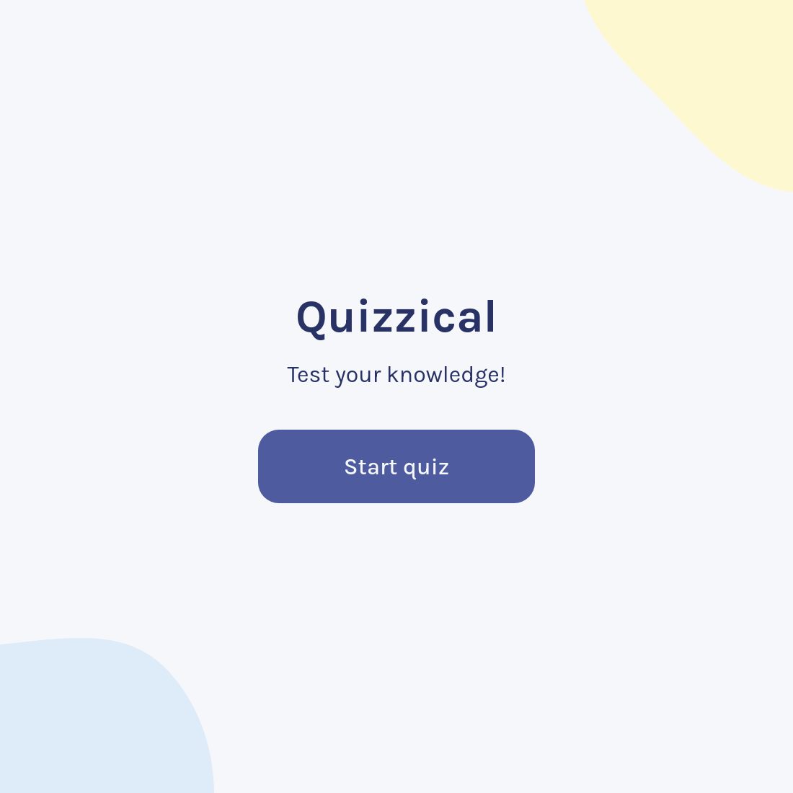
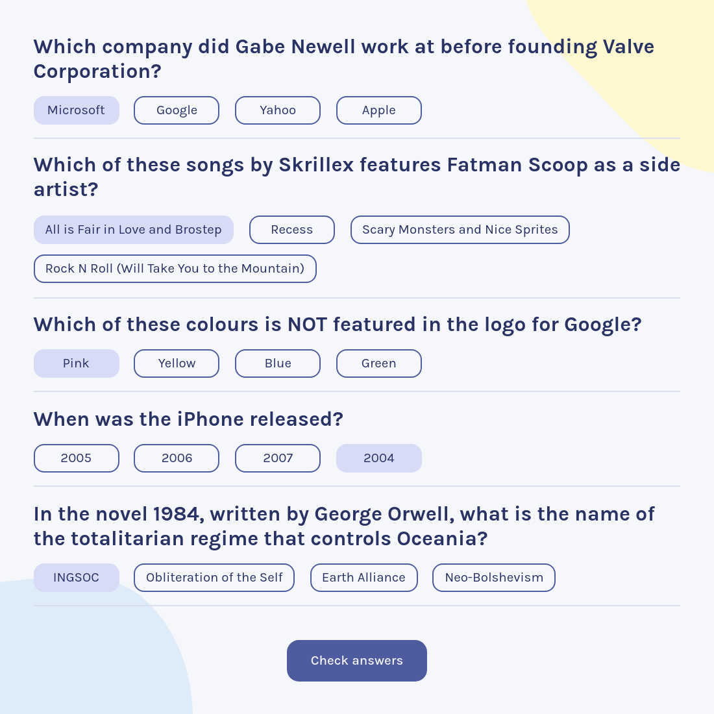
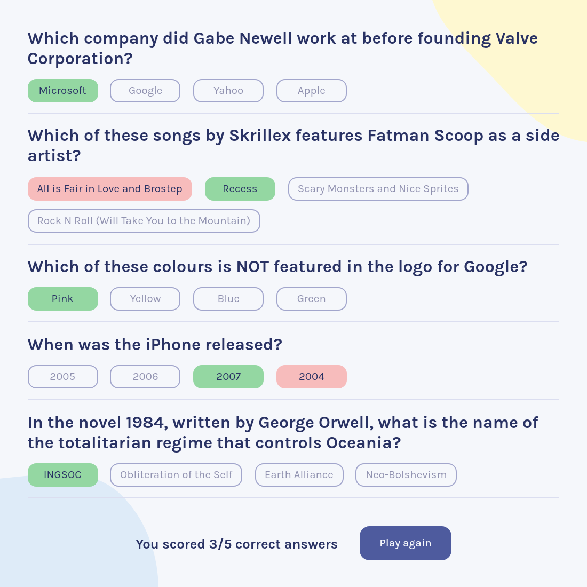

# Quizzical

A solo project from the [Scrimba Frontend Developer Career Path](https://scrimba.com/learn/frontend)

## Table of contents

- [Overview](#overview)
  - [Requirements](#requirements)
  - [Screenshots](#screenshots)
  - [Links](#links)
- [My process](#my-process)
  - [Built with](#built-with)
  - [Challenges and learnings](#challenges-and-learnings)
    - [Semantics and accessibility](#semantics-and-accessibility)
    - [When to fetch new data](#when-to-fetch-new-data)
    - [Processing fetched data](#processing-fetched-data)
    - [Scoring](#scoring)
  - [Continued development](#continued-development)
  - [Useful resources](#useful-resources)
- [Author](#author)
- [Acknowledgments](#acknowledgments)

## Overview

### Requirements

- [x] Two screens (start & questions)
- [x] Pull 5 questions from the [OTDB API](https://opentdb.com/api_config.php)
- [x] Tally correct answers after "Check answers" is clicked
- [x] Styled & polished

### Screenshots







### Links

- Live Site URL: [https://quizzical12.netlify.app/](https://quizzical12.netlify.app/)
- Scrim URL: [https://scrimba.com/scrim/co5864f7fa2a0b0b0b3ee67d4](https://scrimba.com/scrim/co5864f7fa2a0b0b0b3ee67d4)

## My process

### Built with

- Semantic HTML5 markup
- CSS Flexbox
- Mobile-first workflow
- JavaScript Async/Await
- [React](https://reactjs.org/) - JS library
- [Create React App](https://create-react-app.dev/) - zero-config React starter

### Challenges and learnings

This project is a big one for me, as it's the first React app I deployed in a public URL. I encountered a lot of challenges, and learned a lot of things as well. Let's go through each one:

#### Semantics and accessibility

Initially, I structured the answers as an unordered list and added an event listener that toggles the "selected" status for each list item on click. However, this presents a bug where users can select multiple answers for one question.

So, I turned the answers into **radio buttons**, which not only prevents the user from selecting multiple answers, but also improves accessibility for keyboard users. Following the design spec, I removed the radio buttons visually (I found [a way to hide radio buttons without affecting accessibility](https://stackoverflow.com/a/22462740)) and instead applied styling to the label itself whenever an answer is selected.

#### When to fetch new data

This was tricky at first - I'm using `useEffect` to fetch the questions data from the OTDB API. I knew I had to put something in the dependency array to conditionally trigger the fetch operation, but what variable should I use?

Since I only want to fetch a new set of questions when the user finishes a game and clicks on the "Play again" button, I decided to add a `round` state in my dependency array. Initially, `round` will have a value of `1`, and when the user finishes a quiz and starts a new one, `round` will increase by 1, thus trigerring the fetch operation in the `useEffect` block.

The fetch operation happens as the Start page is loaded, so by the time the user clicks on the "Start quiz" button, the fetch request is already finished and the data is ready to be rendered on the Questions page.

#### Processing fetched data

The API request returns an object, which contains an array of objects with the following structure:

```js
[
    {
        category: "General Knowledge",
        type: "multiple",
        difficulty: "easy",
        question: "Which American president appears on a one dollar bill?",
        correct_answer: "George Washington",
        incorrect_answers: [
            "Thomas Jefferson",
            "Abraham Lincoln",
            "Benjamin Franklin"
        ]
    },

    // ...
]
```

In the early stages, I was fetching the data as-is, only applying transformations in the component-level. This includes combining `correct_answer` and `incorrect_answers` into a single array, and then shuffling the answers so the correct answer is not always the first one. However, the problem with this approach is that every time the app gets re-rendered, the answers get shuffled as well!

This is when I learned that when fetching data, it's better to create a new object that **stores only what you need**, and **applies data transformations upfront**. I created a callback function to handle data processing:

```js
function processData(item) {
    // Decode html entities in the questions and answers
    const question = decode(item.question)
    const correctAnswer = decode(item.correct_answer)
    const incorrectAnswers = item.incorrect_answers.map(answer => decode(answer))

    // Combine and shuffle answers into a single array
    const answers = [correctAnswer, ...incorrectAnswers]
    shuffle(answers)

    return {
        question: question,
        answers: answers,
        correctAnswer: correctAnswer,
        // Set a unique identifier for each question
        id: nanoid(),
        // Add a property where we'll store the user's answer
        userAnswer: ""
    }
}
```

...which is called whenever I fetch new data:

```js
const response = await fetch(url)
const data = await response.json()
const questions = await data.results.map(processData)
````

The questions are stored in the state, ready to be passed as props to child components.

#### Scoring

Once I settled on the data structure above, it was easy to add a `userAnswer` property. This has two benefits:

1. Scoring is as simple as checking if `userAnswer === correctAnswer` for each question. Since `userAnswer` has an empty string for its initial value, even if the user skips a question, the logic would simply count it as a wrong answer.

2. Having a `userAnswer` property in the state allows the answers to be implemented as **controlled components**, so there's a single source of truth.

### Continued development

Ideas for new features:

- Loading screen that explicitly informs the user when the questions are still being loaded
- Require the user to select an answer for every question (currently users can skip questions)
- Dropdown options to change category, difficulty, question count, etc.

### Useful resources

- [The "Checkbox Hack" (and things you can do with it)](https://css-tricks.com/the-checkbox-hack/) - This helped me implement the answer components in a semantic way.

- [Techniques for WCAG 2.1](https://www.w3.org/WAI/WCAG21/Techniques/) - Helped me while deciding which HTML tags to use in my components, how to arrange them (e.g. labels for radio buttons should come *after* the `<input type="radio"` tag, not before).

## Author

- Website - under construction
- GitHub - [@joshjavier](https://github.com/joshjavier)
- Twitter - [@joshjavierr](https://twitter.com/joshjavierr)
- LinkedIn - [@joshjavier](https://www.linkedin.com/in/joshjavier/)

## Acknowledgments

The brain emoji favicon is from the open-source project [Twemoji](https://twemoji.twitter.com/), made by Twitter and other contributors, licensed under [CC BY 4.0](https://creativecommons.org/licenses/by/4.0/).
